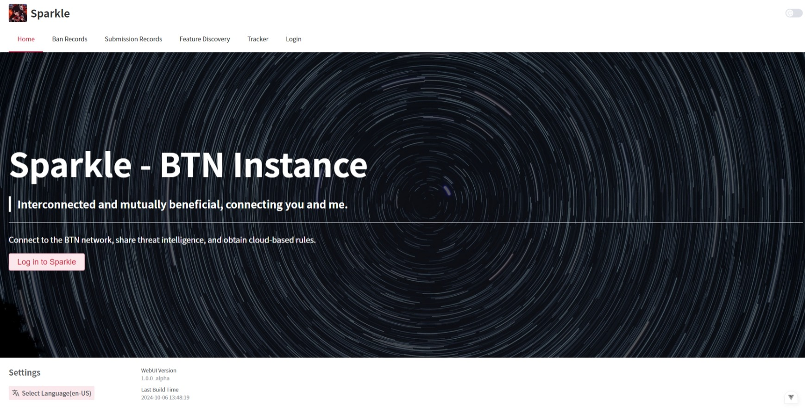
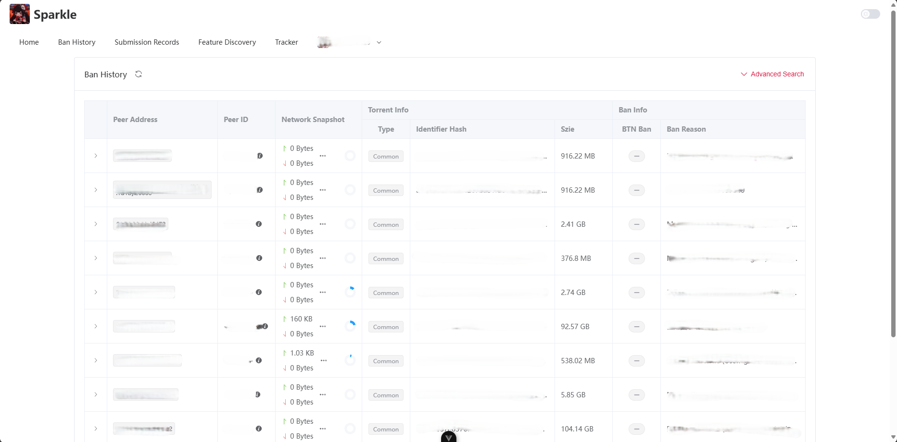
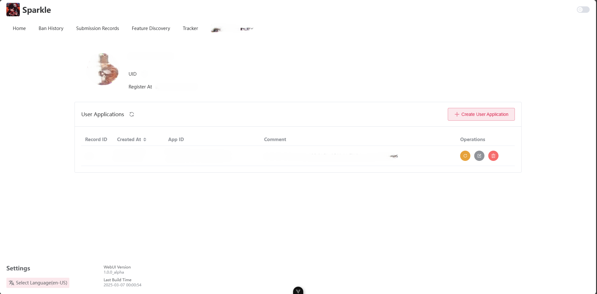

# sparkle-web

A WebUI of [Sparkle](https://github.com/PBH-BTN/Sparkle), based on [Element Plus](https://element-plus.org/) and support [i18n(vue-i18n-routing)](https://vue-i18n.intlify.dev/).

## Feature

- [x] Log in/out Sparkle

- [x] Manage User Application

- [x] Ban History with search

- [x] Snapshot with search

- [x] Client Discovery with search

- [ ] Tracker with search

## Screenshots







## How to contribute

### Recommended IDE Setup

[VSCode](https://code.visualstudio.com/) + [Volar](https://marketplace.visualstudio.com/items?itemName=Vue.volar) (and disable Vetur).

### Type Support for `.vue` Imports in TS

TypeScript cannot handle type information for `.vue` imports by default, so we replace the `tsc` CLI with `vue-tsc` for type checking. In editors, we need [Volar](https://marketplace.visualstudio.com/items?itemName=Vue.volar) to make the TypeScript language service aware of `.vue` types.

### Customize configuration

See [Vite Configuration Reference](https://vitejs.dev/config/).

### Project Setup

```sh
pnpm install
```

#### Compile and Hot-Reload for Development

Before compiling the project, make sure to set up the environment variables based on the `env example` file.

```sh
pnpm dev
```

#### Type-Check, Compile and Minify for Production

```sh
pnpm build
```

#### Lint with [ESLint](https://eslint.org/)

```sh
pnpm lint
```

#### Format with [Prettier](https://prettier.io/)

```sh
pnpm format
```

